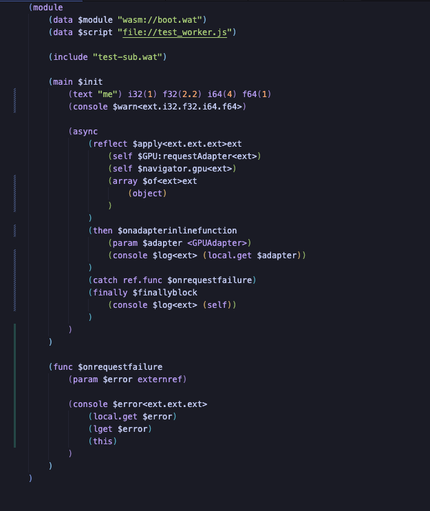

# wat4wasm

   
  <strong><code>wat4wasm</code></strong>
   
   
  sweet <em><strong>WebAssembly</strong></em> sugars
   
  Designed to make you faster, smarter and aesthetically pleasing WebAssembly coder.

  
  

## BAŞLIK
İçerik

## Why wat4wasm?

Writing WebAssembly Text (WAT) often feels like stepping back in time. While the performance is futuristic, the developer experience is archaic. You manually manage indices, define every single import, and struggle with basic tasks like string handling or asynchronous flows.

**wat4wasm** changes the game.

It is a pre-compiler that treats WebAssembly as a first-class citizen of the JavaScript ecosystem. It introduces "syntactic sugars" and powerful macros that allow you to write WASM with the expressiveness of a high-level language.

**Core Philosophies:**
1.  **The Magic `$self`**: Access the entire JavaScript host environment (`window`, `console`, `DOM`, etc.) directly from WASM without writing a single manual import.
2.  **Modern Syntax**: Use `async/await`, `new` constructors, and dot-notation for property access.
3.  **Seamless Integration**: Embed files, compile other WAT modules inline, and auto-generate boilerplate.

It's not just a compiler; it's the bridge that makes WebAssembly fun to write. 
 
 

### Key examples:

 

## API
1. (text/string  ...) (examples-01)
2. (include      ...) (examples-02)
3. (ref.extern   ...) (examples-03)
4. (ref.func     ...) (examples-04)
5. (global.get   ...) (examples-05)
6. (async        ...) (examples-06)
7. (data.size/view ...) (examples-07) 

## Reflectors (examples-08)
1. (reflect $...)
2. (array   $...)
3. (object  $...)
4. (string  $...)
5. (number  $...)
6. (math    $...)
7. (url     $...)
8. (console $...)

### Example for a few code transformations:

 
 
 

## License

This project is licensed under the MIT License - see the [LICENSE](LICENSE) file for details.

---

  <a target="_blank" href="https://gemini.google.com/">Gemini</a> and <a target="_blank" href="https://github.com/tokbuga">Özgür</a> created with 💚

